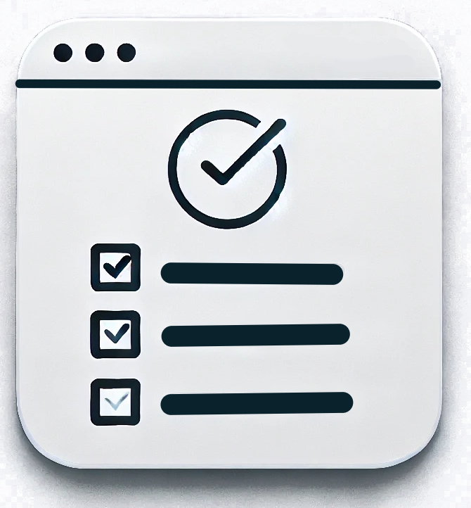

<h1 align=center>Listing Tools</h1>

☑️ This website is working!

To-do lists are a long term tool for everyone. Even that you don't use it in a web or mobile application, you have at least one on your mind to organize your everyday work.

This web app contain **3 types of lists** to work:

1. A to-do list;
2. A wish list;
3. And a guest list.

To-do and wish list work at the same way, the guest list works a little different. You can add a e-mail for every guest and send a invite to everyone in the list.

## Development Details

The **Listing Tools** app was created with *React.js* and *Bootstrap* for styling.

For managing storage between sessions, the app add everything to `LocalStorage` API, separately. Nothing goes out of your browser.

You can add, mark as completed, remove and edit every task/wish/guest you add to your lists.

## Contribute

Since most of this is a study project, contributes to code aren't accepted, but suggestions for new features, bugs and everything related are accepted in *[Issues](https://github.com/orangethewell/listing-tool/issues)* tab.

Take a look if your issue isn't published yet!